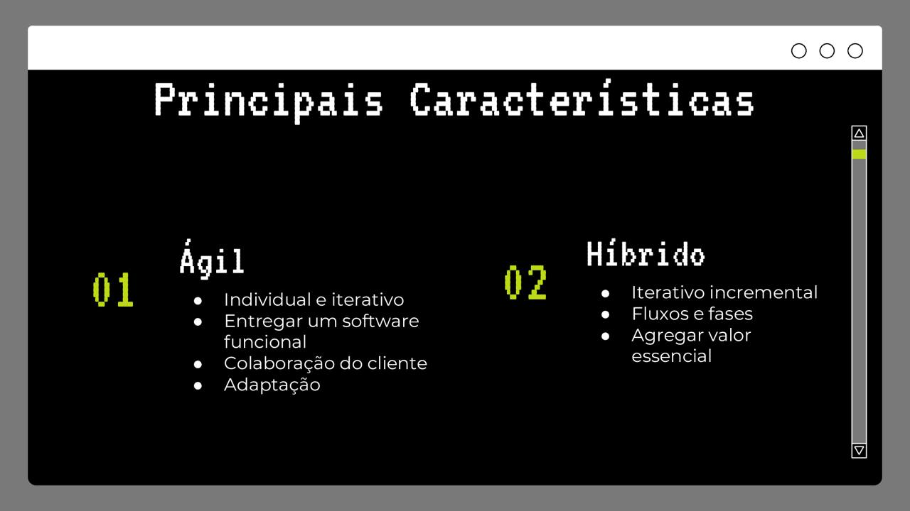
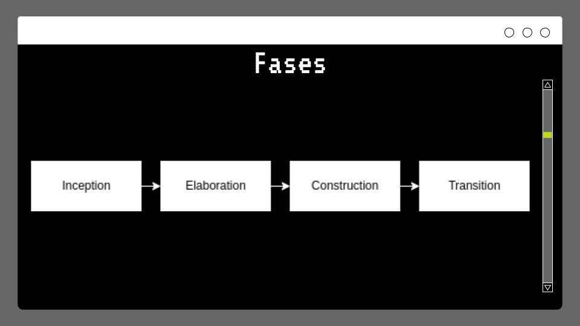
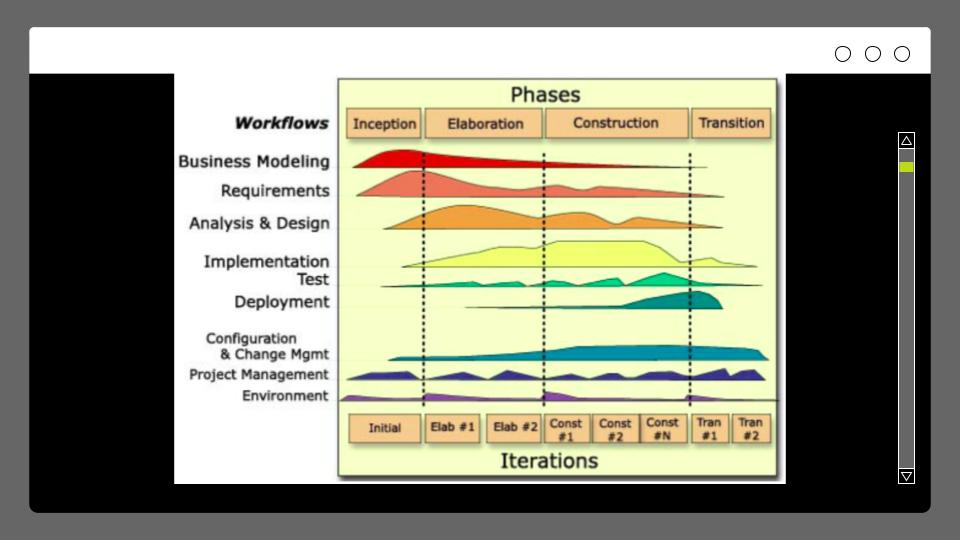
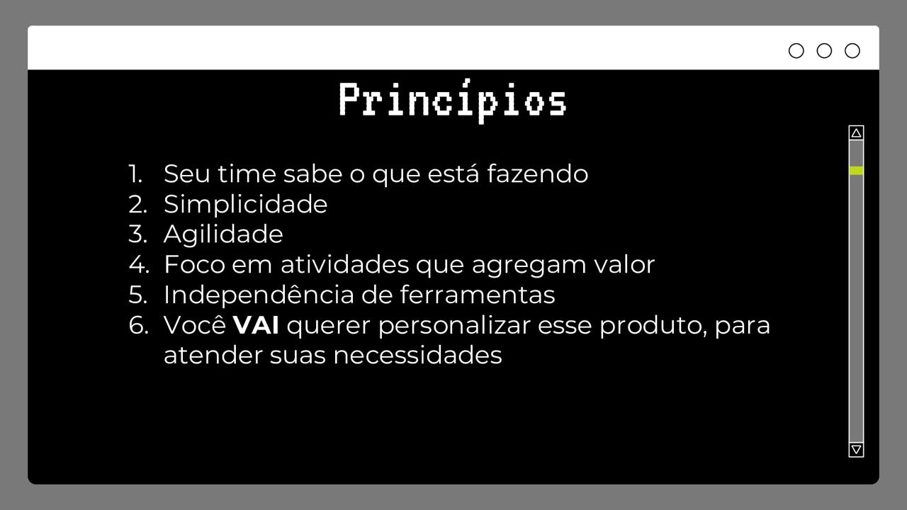
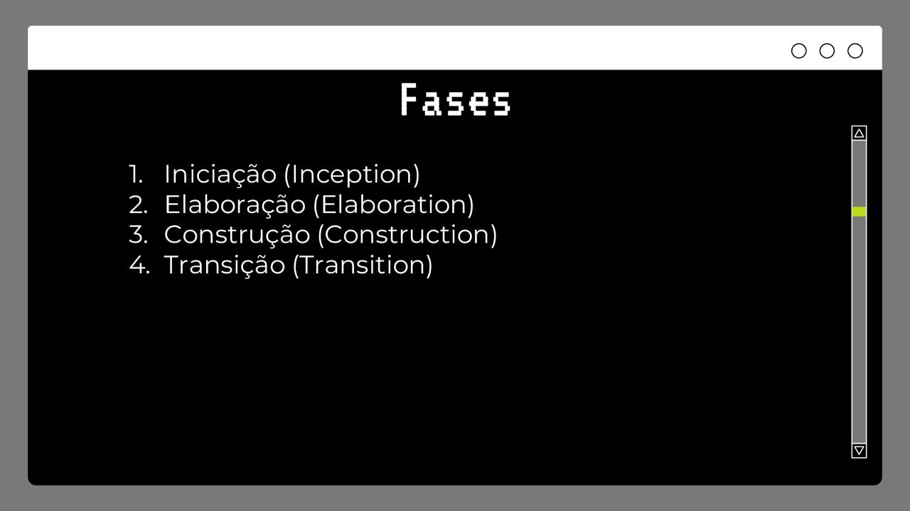
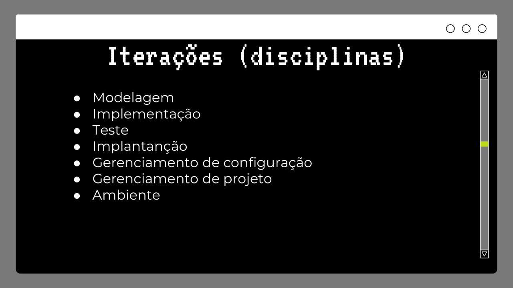
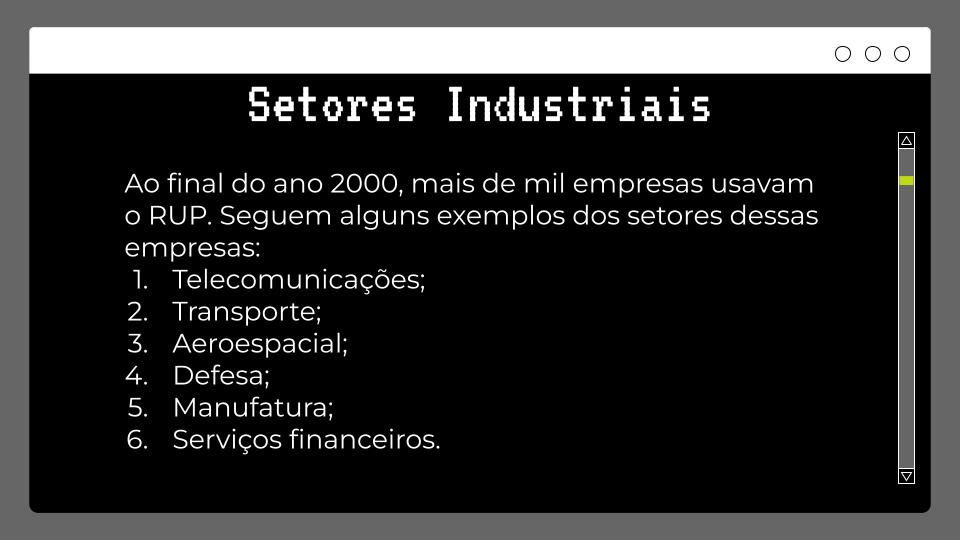
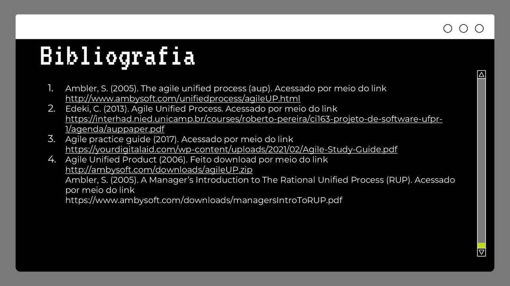

<h1 align="center">Volati-Loja</h1>

<h3 align="center">2022.2</h3>

 

# Índice
- [Equipe](#equipe🚀)

# Equipe🚀

| Nome                                                              | Matrícula   |  Disciplina |
| ----------------------------------------------------------------- | ----------  | ----------  |
| [Bruno Seiji Kishibe](https://github.com/brun0sk)                 | 200072854   | REQ         |
| [Daniel Rocha Oliveira](https://github.com/DanRocha18)            | 190104821   | REQ         |
| [Dion Vitor do Prado](https://github.com/DionVitor)               | 200016989   | REQ         |
| [Leonardo Michalski Miranda](https://github.com/leomichalski)     | 190046945   | REQ         |
| [Lucas Sales Ribeiro](https://github.com/Lux-Sales)               | 180105451   | REQ         |
| [Luiz Gustavo Lopes Campos](https://github.com/Luiz-GL-Campos)    | 180023179   | REQ         |

 

<h2 align="center">Visão do Produto e Projeto</h2>

## 1. Visão geral do produto

### 1.1 Declaração de Posição do Produto

É uma loja online de produtos para skate onde também é possível achar tênis, roupas e acessórios. Os vídeos dos atletas patrocinados pela loja podem ser visualizados no site. Além disso, há uma seção para a comunidade do skate conferir peças velhas disponíveis para doação.

| Software         | ElectroFarm                                                                                                                          |
| ---------------- | ------------------------------------------------------------------------------------------------------------------------------------ |
| Para             | Gerente da DSPS, skatistas, familiares de crianças, pessoas que gostam de roupas de skate.                                           |
| Quem             | Loja De Skatista Para Skatista                                                                                                       |
| O DSPS_Skateshop | É uma solução cliente-servidor                                                                                                       |
| Que              | vende tênis, roupas, acessórios e outros produtos relacionados a skate.                                                              |
| Ao contrário     | de outras lojas virtuais de Brasília, que somente vendem produtos e acessórios relacionados a skate,                                 |
| Nosso produto    | mostra vídeos de atletas brasilienses que patrocinamos, disponibiliza peças de skate velhas para doação e tem uma interface simples. |

### 1.2 Objetivos do Produto

Oferecer uma plataforma de vendas virtual, onde a presença de um usuário operando o sistema não seja necessária, para que as mesmas ocorram. Além de ter seções compartilhando com os clientes informações que a loja julga pertinente.

### 1.3 Tecnologias a Serem Utilizadas

React, TypeScript, styled-components, Python, FastAPI, PostgreSQL e Firebase.

## 2. Visão Geral do Projeto

### 2.1 Organização do Projeto

| Papel                         | Atribuições      | Responsável      | Participantes                           |
|------------------------------ | ---------------- | ---------------- | --------------------------------------- |
| Desenvolvedor Front-end       | Desenvolver o produto na parte visual, manipulando os dados, para mostrar ao cliente de forma legível, e enviar ao backend de forma bem estruturada. | Lucas Sales  | Lucas Sales, Daniel Rocha |
| DBA (Database Administrator)  | Desenvolver banco de dados, tabelas, relações entre as mesmas, e demais necessidades de banco.| Leonardo Miranda | Leonardo Miranda |
| Desenvolvedor Back-end       | Desenvolver conversação com o banco de dados, manusear os dados, para serem inseridos no banco, e apresentados no front-end. | Luiz Gustavo     | Luiz Gustavo, Bruno Kishibe, Dion Vitor |

### 2.2 Planejamento das Fases e/ou Iterações do Projeto

| Sprint   | Produto                       | Data início | Data Fim |
| -------- | ----------------------------- | ----------- | -------- |
| Sprint 1 | Elicitaçao de requisitos, definição de MVP, configuração de ambiente de desenvolvimento              | 21/11/22 | 02/12/22 |
| Sprint 2 | MVP e Planejamento do Projeto                                                                        | 05/12/22  | 16/12/22 |
| Sprint 3 | Desenvolvimento de funcionalidades a serem definidas                                                 | 19/12/22  | 30/12/22 |
| Sprint 4 | Desenvolvimento de funcionalidades a serem definidas                                                 | 02/01/23  | 13/01/23 |
| Sprint 5 | Desenvolvimento de funcionalidades a serem definidas                                                 | 16/01/23  | 27/01/23 |
| Sprint 6 | Desenvolvimento de funcionalidades a serem definidas, configuração do ambiente de produção de deploy | 30/01/23  | 10/02/23 |
| Revisão  | Tratamento de últimos erros, e ajustes mínimos                                                       | 13/02/23  | 16/02/23 |   

### 2.3 Matriz de Comunicação

| Descrição   | Área/Envolvidos                       | Periodicidade | Produtos Gerados |
| -------- | ----------------------------- | ----------- | -------- |
| - Acompanhamento das Atividades em Andamento   - Acompanhamento dos Riscos, Compromissos, Ações Pendentes, Indicadores | - Equipe do Projeto           | - Quinzenal | -Possíveis requisitos/tasks pendentes a serem resolvidos na próxima sprint |
| -Relatório do produto;   -Parecer do estado atual do produto;   -Alinhamento de expectativas e requisitos para próxima sprint | -Equipe do projeto    -Cliente | -Quinzenal   | -Ata de reunião    -Lista de requisitos candidatos a estar no backlog da próxima sprint|
| - Comunicar situação do projeto | - Equipe    - Prof.                        | - Semanal  | - Relatório de situação do projeto |
 

### 2.4 Gerenciamento de Riscos

Ao início de cada sprint, será realizada uma reunião de planejamento (planning), com a equipe de desenvolvimento, visando levantar o que deve ser feito sprint em questão, após a equipe ter isso definido, o mesmo será passado ao cliente, para que este, verifique se faz sentido estas entregas, nessa ordem, lembrando que essa será uma segunda verificação, onde a primeira, será feita na elicitação de requisitos. Ao final da sprint, uma reunião de revisão (review) será realizada juntamente ao cliente, onde serão apresentadas as entregas de valor, para que o mesmo dê um retorno, sobre suas expectativas, e se o desenvolvimento do projeto está satisfatório. Caso um risco seja identificado, podemos proceder da seguinte forma:

<ul>
    <li>Risco leve: Bug’s gerados por falta de atenção, não previstos, que são fáceis de arrumar, serão tratados na sprint em que foram identificados.</li>
    <li>Risco mediano: Problema com uma complexidade maior, afeta parte do sistema, mas temos uma noção de como resolvê-lo, serão orçados em conjunto do time e do cliente, podendo ser resolvidos na sprint em que foram identificados, ou na seguinte, demandando mais atenção e cuidado.</li>
    <li>Risco grave: Problema de alta complexidade, que afeta a integridade ou segurança do sistema, que a equipe não sabe como resolver. O desenvolvimento é interrompido, e a equipe se dispõe a resolver o problema o mais rápido possível, de forma eficiente, para que o desenvolvimento seja retomado, sem maiores problemas. </li>
</ul>

### 2.5 Critérios de Replanejamento

<ul>
    <li>A necessidade do cliente mudar: Caso este cenário ocorra, precisaremos replanejar o produto, para que atenda às novas necessidades do cliente.</li>
    <li>A equipe não conseguir entregar o que está se propondo: Caso a equipe não consiga entregar o que está sendo combinado, teremos de replanejar nossa abordagem, talvez fazer mais acompanhamentos, ou diminuir a carga do backlog das sprints.</li>
    <li>Termos retirada do DBA do projeto, nisso, precisaremos utilizar uma ferramenta de ORM, para que transforme código python, em querys SQL, para que utilizemos o banco de dados de forma adequada. </li>
</ul>

## Slides

## 4. LIÇÕES APRENDIDAS

### 4.1 Unidade 1

<ul>
    <li>Aprender como conversar com o cliente, para que ele nos diga o que ele precisa, que conversar balela, constrói relacionamento, e isso é positivo para o projeto.</li>
    <li>Abordagens de desenvolvimento de software, e para qual caso, cada uma se adequaria.</li>
    <li>Teoria da engenharia de requisitos</li>
</ul>